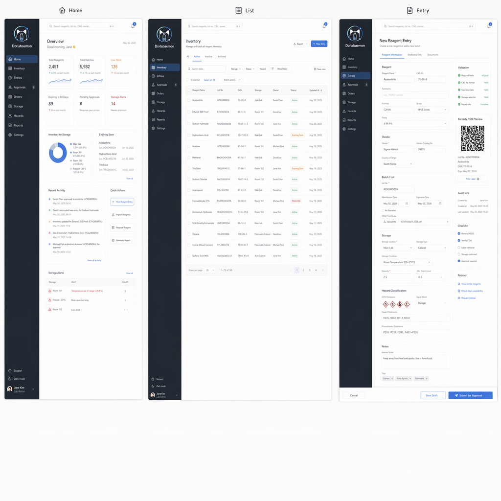

<p align="center">
  
</p>

<h1 align="center">Dorlabaemon</h1>

<p align="center">面向科研实验室的试剂库存管理与实验可行性判断系统</p>

<p align="center">
  <a href="https://github.com/Chen-Era/DoLabaemon/blob/main/LICENSE"></a>
  <a href="https://github.com/Chen-Era/DoLabaemon/releases"></a>
  <a href="https://dorlabaemon.era.ac.cn"></a>
</p>

Dorlabaemon 将试剂库存、实验规则和实验室成员权限放在同一套系统中。研究人员可以录入或导入试剂，查看实验所需的材料是否已齐备，也可以在一个实验室内共享库存，同时与其他实验室隔离数据。

在线体验：[dorlabaemon.era.ac.cn](https://dorlabaemon.era.ac.cn)

<p align="center">
  
</p>

## 功能

| 功能 | 说明 |
| --- | --- |
| 试剂库存 | 新建、编辑和删除试剂记录；按名称、货号、标签或靶点筛选；支持库存增减、批量删除和复制导出。 |
| AI 解析 | 填写试剂名称或货号后，系统可将信息整理为结构化字段。配置搜索与模型服务后，还可进行联网核验与自检。 |
| 实验可行性判断 | 根据库存检查 WB、qPCR、IF、ELISA 和 FLOW 的必需项与推荐项，并说明缺失的材料。 |
| 知识标签与规则 | 试剂标签覆盖抗体靶点和宿主、引物序列、内参、细胞培养、转染、筛选等信息。系统还提供自噬和外泌体相关规则。 |
| 知识维护 | 可配置 Skill 与 MCP 服务。AI 解析会保留自检记录；实验室管理员可按策略启用知识自动写回，并查看或回滚相关变更。 |
| Hermes 集成 | 可选用 Hermes Agent 在服务器上定时整理试剂知识并导出 JSONL。项目校验并导入后，知识库命中可减少联网核验。 |
| 多实验室协作 | 实验室内成员共享库存；实验室之间的数据相互隔离。PI 和管理员可以邀请成员。 |
| Web 与桌面端 | Web 应用使用 Next.js，桌面端使用 Electron，两端共享一个项目代码库。桌面端连接已部署的服务，不在本地运行数据库或保存服务端密钥。 |

## 快速开始

### DEMO 模式（约 30 秒）

DEMO 模式不需要 PostgreSQL 或 Docker，适合先体验主要流程。数据会保存到 `.data/demo-store.json`。

```bash
npm install
cp .env.example .env
# 将 .env 中的 DEMO_MODE 改为 "true"
npm run dev
```

打开 [http://localhost:3000](http://localhost:3000)。

### 数据库模式（macOS）

安装并启动 Docker Desktop 后，下面的脚本会启动 PostgreSQL 容器、创建 `.env`、安装依赖、执行数据库迁移并写入初始数据：

```bash
bash scripts/setup-macos.sh
npm run dev
```

首次启动后，注册账号并创建或加入实验室即可开始使用。脚本会在首次创建 `.env` 时提示你填写 `OPENAI_API_KEY`。

### 手动初始化数据库

如果你的 PostgreSQL 已经可用，先将 `.env` 中的 `DEMO_MODE` 设为 `"false"`，并填写正确的 `DATABASE_URL`，然后执行：

```bash
npm install
cp .env.example .env
npx prisma generate
npx prisma migrate dev
npm run db:seed
npm run dev
```

## 配置

从 `.env.example` 复制生成 `.env` 后，按需要填写以下配置：

| 配置 | 用途 |
| --- | --- |
| `DEMO_MODE` | `true` 使用演示数据；`false` 使用 PostgreSQL。 |
| `DATABASE_URL` | PostgreSQL 连接字符串。 |
| `NEXTAUTH_URL`、`NEXTAUTH_SECRET` | 登录地址与会话加密密钥。本地开发地址为 `http://localhost:3000`。 |
| `OPENAI_BASE_URL`、`OPENAI_API_KEY`、`OPENAI_MODEL`、`OPENAI_VISION_MODEL` | OpenAI 兼容模型服务的地址、密钥与模型名称。 |
| `REAGENT_SEARCH_*` | 联网核验所需的搜索服务配置。 |
| `LLM_ENABLED_SKILLS`、`LLM_ENABLED_MCP_SERVERS` | 启用的 Skill 与 MCP 服务。 |
| `LLM_SELF_CHECK_ENABLED`、`LLM_AUTO_LEARN_ENABLED` | 是否启用 AI 自检与自动学习写回。 |
| `LLM_REASONING_EFFORT` | 模型推理等级，可选 `off`、`low`、`medium` 或 `high`。 |
| `LLM_KNOWLEDGE_VERIFY_*` | 知识库高置信命中时跳过联网验证的开关与阈值。 |
| `HERMES_KNOWLEDGE_EXPORT_PATH` | Hermes 导出 JSONL 的路径。 |

完整的默认值和说明见 [`.env.example`](.env.example)。不要将包含真实密钥的 `.env` 提交到仓库。

## 技术栈

- Next.js 16、React 19、TypeScript 5 与 Tailwind CSS 4
- Electron 40
- Prisma 6 与 PostgreSQL

## 桌面客户端

桌面端是已部署 Web 服务的客户端，需要可用的网络与 HTTPS 服务。开发和打包命令如下：

```bash
npm run desktop:dev
npm run desktop:dist:mac
npm run desktop:dist:win
```

客户端的连接范围、安全边界与发布步骤见[桌面客户端文档](docs/desktop-client.md)。

## 文档

| 文档 | 内容 |
| --- | --- |
| [系统架构](docs/architecture.md) | 前端、API、数据库、鉴权、AI 编排和知识库模块。 |
| [API 文档](docs/api.md) | 路由与请求用途。 |
| [规则设计](docs/rule-design.md) | 实验必需项、推荐项与方向规则。 |
| [桌面客户端](docs/desktop-client.md) | Electron 客户端的构建、配置与安全边界。 |
| [服务器部署](docs/deployment-server.md) | Docker、Caddy 和 Nginx 的生产部署。 |
| [Hermes 知识管家](integrations/hermes/README.md) | Hermes 的部署、定时产出与导入流程。 |
| [Hermes 集成机制](docs/hermes-integration.md) | 项目侧的校验、写库和检索置信度机制。 |

## 生产部署

仓库提供 `Dockerfile`、`docker-compose.prod.yml` 以及 Caddy 和 Nginx 配置示例。部署前请配置 PostgreSQL、站点地址、会话密钥和模型服务。完整步骤见[服务器部署文档](docs/deployment-server.md)。

## 许可证

本项目使用 [MIT License](LICENSE)。
