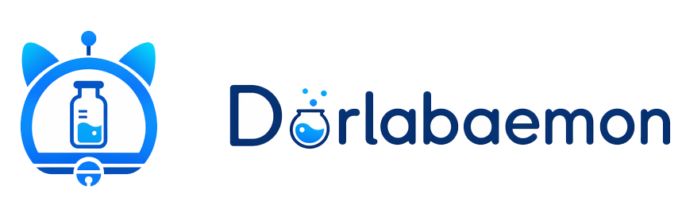
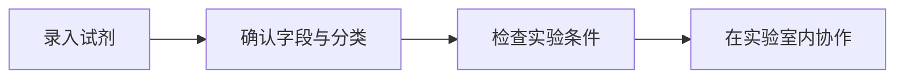
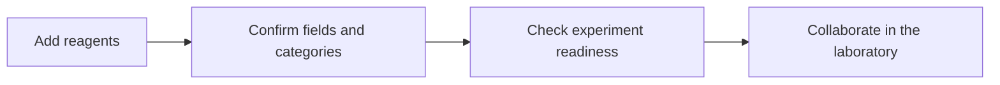

<p align="center">
  
</p>

<h1 align="center">Dorlabaemon</h1>

<p align="center">Reagent inventory management and experiment-readiness checks for research laboratories</p>

<p align="center">
  <a href="https://github.com/Chen-Era/DoLabaemon/blob/main/LICENSE"></a>
  <a href="https://github.com/Chen-Era/DoLabaemon/releases"></a>
  <a href="https://dorlabaemon.era.ac.cn"></a>
</p>

<p align="center">
  <a href="#chinese">中文</a> | <a href="#english">English</a>
</p>

<a id="chinese"></a>

## 中文

Dorlabaemon 把试剂库存、实验规则和实验室成员权限放在同一个工作区中。研究人员可以录入或导入试剂，确认字段和分类，再检查某项实验所需的材料是否齐备。团队成员查看的是同一份库存，实验室之间的数据保持隔离。

在线体验：[dorlabaemon.era.ac.cn](https://dorlabaemon.era.ac.cn)

[English](#english)

### 项目要解决什么问题

实验准备不只是确认货架上有没有一瓶试剂。还要核对名称和货号是否准确，它是否符合当前实验的用途，以及团队成员是否在查看同一份记录。把这些信息分别放在库存表、实验清单和个人记录里，会让实验前的确认变得费时，也容易遗漏条件。

Dorlabaemon 的工作流程是录入、确认、检查、协作。它不替代实验方案或人工判断，而是把准备实验时需要核对的库存、规则和协作信息集中起来。



| 实验准备中的问题 | Dorlabaemon 的做法 |
| --- | --- |
| 试剂记录只有名称或货号，难以按实验用途核对。 | 将试剂整理为结构化字段，并用抗体、引物、内参、细胞培养、转染和筛选等标签描述用途。 |
| 知道库存里有什么，却不清楚能否开始一项实验。 | 将库存映射到实验的必需项和推荐项，列出已满足、待补充和需要注意的条件。 |
| 团队成员各自维护记录，实验室之间又需要边界。 | 以实验室为单位共享库存；PI 和管理员可邀请成员，实验室数据相互隔离。 |

### 项目亮点

#### 从库存记录走到实验条件

系统不仅保存库存数量，也会根据试剂标签、抗体靶点和引物信息检查实验要求。当前规则覆盖 WB、qPCR、IF、ELISA 和 FLOW，也包含自噬与外泌体的相关判断。

#### AI 负责整理，人负责确认

填写试剂名称或货号后，系统可以生成结构化解析草稿。配置模型和搜索服务后，还可进行联网核验与自检。解析结果在入库前仍需确认，避免把自动生成的内容直接当作实验记录。

#### 规则与知识可以维护

实验技术可作为草稿提交、审核并发布为修订版本。AI 自检和知识写回会留下记录，实验室管理员可以查看并回滚变更。可选的 Hermes 集成会在服务器上定时整理试剂知识，导出 JSONL 后由项目校验并导入。高置信度的知识库命中可以减少联网核验。

#### 一套工作区服务团队协作

Web 应用使用 Next.js，桌面端使用 Electron，两端共享一个项目代码库。桌面端连接已部署的服务，不在本地运行数据库或保存服务端密钥。

### 功能一览

| 功能 | 说明 |
| --- | --- |
| 试剂库存 | 新建、编辑和删除试剂记录；按名称、货号、标签或靶点筛选；支持库存增减、批量删除和复制导出。 |
| 实验可行性判断 | 根据库存检查实验的必需项与推荐项，并说明缺失的材料。 |
| 知识维护 | 可配置 Skill 与 MCP 服务；AI 解析会保留自检记录，并可按实验室策略启用知识自动写回。 |
| 多实验室协作 | 实验室内成员共享库存；实验室之间的数据相互隔离。PI 和管理员可以邀请成员。 |

### 快速开始

#### DEMO 模式，约 30 秒

DEMO 模式不需要 PostgreSQL 或 Docker，适合先体验主要流程。数据会保存到 `.data/demo-store.json`。

```bash
npm install
cp .env.example .env
# 将 .env 中的 DEMO_MODE 改为 "true"
npm run dev
```

打开 [http://localhost:3000](http://localhost:3000)。

#### 数据库模式，macOS

安装并启动 Docker Desktop 后，下面的脚本会启动 PostgreSQL 容器、创建 `.env`、安装依赖、执行数据库迁移并写入初始数据：

```bash
bash scripts/setup-macos.sh
npm run dev
```

首次启动后，注册账号并创建或加入实验室即可开始使用。脚本会在首次创建 `.env` 时提示你填写 `OPENAI_API_KEY`。

#### 手动初始化数据库

如果你的 PostgreSQL 已经可用，先将 `.env.example` 复制为 `.env`，再将 `DEMO_MODE` 设为 `"false"` 并填写正确的 `DATABASE_URL`，然后执行：

```bash
npm install
cp .env.example .env
npx prisma generate
npx prisma migrate dev
npm run db:seed
npm run dev
```

### 配置

从 `.env.example` 复制生成 `.env` 后，按需要填写以下配置：

#### 推荐配置：MiMo Token Plan

使用 MiMo Token Plan 时，在服务商提供的 OpenAI 兼容接口地址与 API 密钥之外，推荐使用以下模型和开关：

```dotenv
OPENAI_MODEL="mimo-2.5-pro"
OPENAI_VISION_MODEL="mimo-2.5"
LLM_REASONING_EFFORT="off"
REAGENT_SEARCH_ENABLED="false"
```

这组配置使用 `mimo-2.5-pro` 处理文本，`mimo-2.5` 处理图像，关闭项目的模型推理等级和联网搜索。`OPENAI_BASE_URL` 与 `OPENAI_API_KEY` 请按 MiMo Token Plan 提供的值填写。

| 配置 | 用途 |
| --- | --- |
| `DEMO_MODE` | `true` 使用演示数据；`false` 使用 PostgreSQL。 |
| `DATABASE_URL` | PostgreSQL 连接字符串。 |
| `NEXTAUTH_URL`、`NEXTAUTH_SECRET` | 登录地址与会话加密密钥。本地开发地址为 `http://localhost:3000`。 |
| `OPENAI_BASE_URL`、`OPENAI_API_KEY`、`OPENAI_MODEL`、`OPENAI_VISION_MODEL` | OpenAI 兼容模型服务的地址、密钥与模型名称。 |
| `REAGENT_SEARCH_*` | 联网核验所需的搜索服务配置。 |
| `LLM_ENABLED_SKILLS`、`LLM_ENABLED_MCP_SERVERS` | 启用的 Skill 与 MCP 服务。 |
| `LLM_SELF_CHECK_ENABLED`、`LLM_AUTO_LEARN_ENABLED` | 是否启用 AI 自检与自动学习写回。 |
| `LLM_REASONING_EFFORT` | 模型推理等级，可选 `off`、`low`、`medium` 或 `high`。 |
| `LLM_KNOWLEDGE_VERIFY_*` | 知识库高置信命中时跳过联网验证的开关与阈值。 |
| `HERMES_KNOWLEDGE_EXPORT_PATH` | Hermes 导出 JSONL 的路径。 |

完整的默认值和说明见 [`.env.example`](.env.example)。不要将包含真实密钥的 `.env` 提交到仓库。

### 技术栈

- Next.js 16、React 19、TypeScript 5 与 Tailwind CSS 4
- Electron 40
- Prisma 6 与 PostgreSQL

### 桌面客户端

桌面端是已部署 Web 服务的客户端，需要可用的网络与 HTTPS 服务。开发和打包命令如下：

```bash
npm run desktop:dev
npm run desktop:dist:mac
npm run desktop:dist:win
```

客户端的连接范围、安全边界与发布步骤见[桌面客户端文档](docs/desktop-client.md)。

### 文档

| 文档 | 内容 |
| --- | --- |
| [系统架构](docs/architecture.md) | 前端、API、数据库、鉴权、AI 编排和知识库模块。 |
| [API 文档](docs/api.md) | 路由与请求用途。 |
| [规则设计](docs/rule-design.md) | 实验必需项、推荐项与方向规则。 |
| [桌面客户端](docs/desktop-client.md) | Electron 客户端的构建、配置与安全边界。 |
| [服务器部署](docs/deployment-server.md) | Docker、Caddy 和 Nginx 的生产部署。 |
| [Hermes 知识管家](integrations/hermes/README.md) | Hermes 的部署、定时产出与导入流程。 |
| [Hermes 集成机制](docs/hermes-integration.md) | 项目侧的校验、写库和检索置信度机制。 |

### 生产部署

仓库提供 `Dockerfile`、`docker-compose.prod.yml` 以及 Caddy 和 Nginx 配置示例。部署前请配置 PostgreSQL、站点地址、会话密钥和模型服务。完整步骤见[服务器部署文档](docs/deployment-server.md)。

### 许可证

本项目使用 [MIT License](LICENSE)。

<p align="right"><a href="#english">English</a></p>

<a id="english"></a>

## English

Dorlabaemon brings reagent inventory, experiment rules, and laboratory membership into one workspace. Researchers can add or import reagents, confirm their fields and categories, then check whether an experiment has the materials it needs. Members work from the same inventory while data remains isolated between laboratories.

Live demo: [dorlabaemon.era.ac.cn](https://dorlabaemon.era.ac.cn)

[中文](#chinese)

### What this project solves

Preparing an experiment involves more than finding a bottle on a shelf. Researchers also need to verify the reagent name and catalog number, its suitability for the experiment, and whether the team is working from the same record. When this information is split across inventory sheets, experiment lists, and personal notes, pre-experiment checks take longer and conditions are easier to miss.

Dorlabaemon follows four steps: add, confirm, check, and collaborate. It does not replace an experimental protocol or human judgment. It keeps the inventory, rules, and collaboration details needed before an experiment in one place.



| Preparation issue | Dorlabaemon approach |
| --- | --- |
| Reagent records contain only a name or catalog number, making it hard to check their experimental use. | Organize reagents into structured fields and describe their use with tags for antibodies, primers, reference controls, cell culture, transfection, and selection. |
| The inventory is known, but it is unclear whether an experiment can begin. | Map inventory to required and recommended experiment items, then list fulfilled, missing, and notable conditions. |
| Team members maintain separate records while laboratories still need clear boundaries. | Share inventory within a laboratory. PIs and administrators can invite members, while laboratory data stays isolated. |

### Highlights

#### From inventory records to experiment readiness

The system stores more than inventory quantities. It checks experiment requirements using reagent tags, antibody targets, and primer information. Current rules cover WB, qPCR, IF, ELISA, and FLOW, with additional checks for autophagy and exosome work.

#### AI organizes, people confirm

After a reagent name or catalog number is entered, the system can generate a structured parsing draft. With model and search services configured, it can also run online verification and self-checks. The result still requires confirmation before it enters the inventory, so generated content does not become an experiment record automatically.

#### Maintainable rules and knowledge

Experiment techniques can be submitted as drafts, reviewed, and published as revisions. AI self-checks and knowledge write-backs are recorded so laboratory administrators can review and roll back changes. The optional Hermes integration researches reagent knowledge on a server at scheduled intervals, exports JSONL, and lets the project validate and import it. High-confidence knowledge-base matches can reduce online verification.

#### One workspace for team collaboration

The web application uses Next.js and the desktop client uses Electron. Both use the same project codebase. The desktop client connects to a deployed service and does not run a database locally or retain server-side secrets.

### Feature overview

| Feature | Description |
| --- | --- |
| Reagent inventory | Create, edit, and delete reagent records. Filter by name, catalog number, tag, or target. Adjust quantities, delete in batches, and copy or export selected records. |
| Experiment-readiness checks | Check required and recommended items against inventory and identify missing materials. |
| Knowledge maintenance | Configure Skills and MCP services. AI parsing keeps self-check records, and knowledge write-back can be enabled by laboratory policy. |
| Multi-laboratory collaboration | Members share inventory within a laboratory, while data is isolated between laboratories. PIs and administrators can invite members. |

### Quick start

#### DEMO mode, about 30 seconds

DEMO mode does not require PostgreSQL or Docker and is intended for trying the main workflow. Data is saved to `.data/demo-store.json`.

```bash
npm install
cp .env.example .env
# Set DEMO_MODE="true" in .env
npm run dev
```

Open [http://localhost:3000](http://localhost:3000).

#### Database mode, macOS

After Docker Desktop is installed and running, the following script starts a PostgreSQL container, creates `.env`, installs dependencies, runs database migrations, and seeds initial data.

```bash
bash scripts/setup-macos.sh
npm run dev
```

After the first start, register an account and create or join a laboratory. When the script creates `.env` for the first time, it prompts you to provide `OPENAI_API_KEY`.

#### Initialize the database manually

If PostgreSQL is already available, first copy `.env.example` to `.env`, then set `DEMO_MODE` to `"false"` and provide the correct `DATABASE_URL`, then run:

```bash
npm install
cp .env.example .env
npx prisma generate
npx prisma migrate dev
npm run db:seed
npm run dev
```

### Configuration

Copy `.env.example` to `.env`, then fill in the configuration you need.

#### Recommended configuration: MiMo Token Plan

When using MiMo Token Plan, use the following models and switches in addition to the OpenAI-compatible endpoint and API key provided by the service.

```dotenv
OPENAI_MODEL="mimo-2.5-pro"
OPENAI_VISION_MODEL="mimo-2.5"
LLM_REASONING_EFFORT="off"
REAGENT_SEARCH_ENABLED="false"
```

This configuration uses `mimo-2.5-pro` for text and `mimo-2.5` for images. It disables the project's model reasoning level and online search. Set `OPENAI_BASE_URL` and `OPENAI_API_KEY` to the values provided by MiMo Token Plan.

| Setting | Purpose |
| --- | --- |
| `DEMO_MODE` | Use demo data with `true`; use PostgreSQL with `false`. |
| `DATABASE_URL` | PostgreSQL connection string. |
| `NEXTAUTH_URL`, `NEXTAUTH_SECRET` | The sign-in URL and session encryption secret. The local development URL is `http://localhost:3000`. |
| `OPENAI_BASE_URL`, `OPENAI_API_KEY`, `OPENAI_MODEL`, `OPENAI_VISION_MODEL` | Endpoint, key, and model names for an OpenAI-compatible model service. |
| `REAGENT_SEARCH_*` | Search-service settings for online verification. |
| `LLM_ENABLED_SKILLS`, `LLM_ENABLED_MCP_SERVERS` | Enabled Skills and MCP services. |
| `LLM_SELF_CHECK_ENABLED`, `LLM_AUTO_LEARN_ENABLED` | Whether to enable AI self-checks and automatic learning write-back. |
| `LLM_REASONING_EFFORT` | Model reasoning level: `off`, `low`, `medium`, or `high`. |
| `LLM_KNOWLEDGE_VERIFY_*` | The switch and threshold for skipping online verification on high-confidence knowledge-base matches. |
| `HERMES_KNOWLEDGE_EXPORT_PATH` | Path to Hermes-exported JSONL. |

See [`.env.example`](.env.example) for complete defaults and notes. Do not commit an `.env` file that contains real keys.

### Tech stack

- Next.js 16, React 19, TypeScript 5, and Tailwind CSS 4
- Electron 40
- Prisma 6 and PostgreSQL

### Desktop client

The desktop application is a client for a deployed web service and requires network access and an HTTPS service. Use these commands for development and packaging:

```bash
npm run desktop:dev
npm run desktop:dist:mac
npm run desktop:dist:win
```

See the [desktop client guide](docs/desktop-client.md) for connection scope, security boundaries, and release steps.

### Documentation

| Document | Contents |
| --- | --- |
| [Architecture](docs/architecture.md) | Frontend, API, database, authentication, AI orchestration, and knowledge-base modules. |
| [API](docs/api.md) | Routes and their request purposes. |
| [Rule design](docs/rule-design.md) | Required items, recommended items, and research-direction rules. |
| [Desktop client](docs/desktop-client.md) | Build, configuration, and security boundaries for the Electron client. |
| [Server deployment](docs/deployment-server.md) | Production deployment with Docker, Caddy, and Nginx. |
| [Hermes knowledge steward](integrations/hermes/README.md) | Hermes setup, scheduled output, and import workflow. |
| [Hermes integration](docs/hermes-integration.md) | Project-side validation, persistence, and retrieval-confidence behavior. |

### Production deployment

The repository provides a `Dockerfile`, `docker-compose.prod.yml`, and example Caddy and Nginx configuration. Before deployment, configure PostgreSQL, the site URL, the session secret, and the model service. See the [server deployment guide](docs/deployment-server.md) for the full procedure.

### License

This project is licensed under the [MIT License](LICENSE).

<p align="right"><a href="#chinese">中文</a></p>
